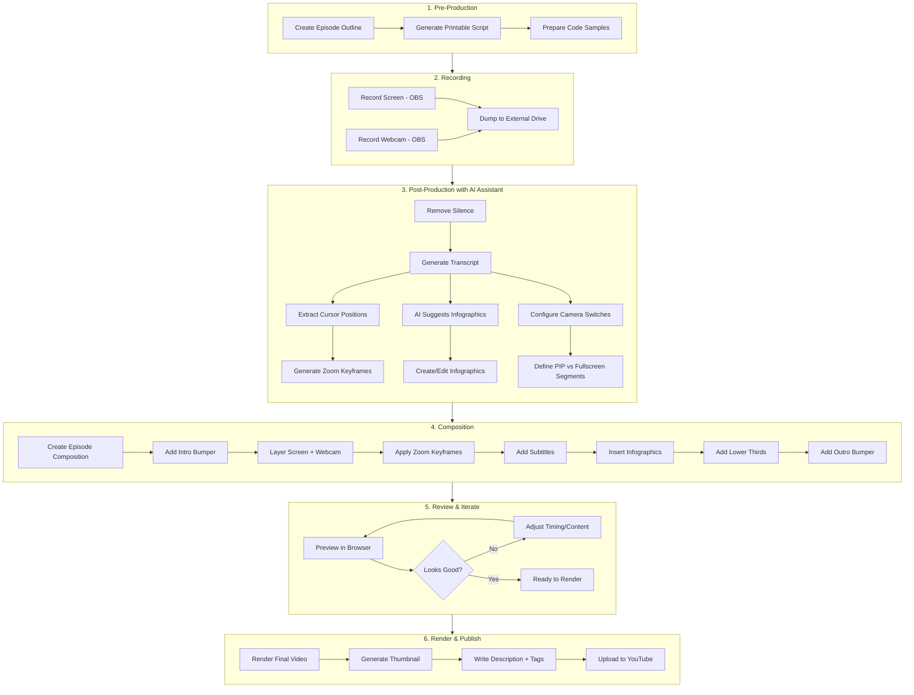

# Remotion Video Projects

Video animations and tutorial compositions for ArtiVisi YouTube channel.

## Complete Production Workflow



## AI-Assisted Workflow Summary

| Step | What You Do | What AI Does |
|------|-------------|--------------|
| Outline | Provide topic & key points | Generate structured outline with timestamps |
| Recording | Record screen + webcam | - |
| Silence Removal | Run script | Detect & remove silent sections |
| Transcription | Run Whisper | Generate timestamped transcript |
| Zoom/Pan | Run cursor extraction | Auto-generate zoom keyframes from cursor movement |
| Infographics | Review suggestions | Suggest slides/callouts based on transcript keywords |
| Camera Switching | Define preferences | Generate switch points based on content type |
| Subtitles | Review output | Generate from transcript |
| Render | Run command | - |
| Upload | Provide credentials | Generate title, description, tags from transcript |

---

## Project Structure

```
src/
├── animations/                    # Standalone bumper animations
│   ├── vlog-intro/               # "NGOPI DULU" intro bumper
│   ├── lower-third/              # Name/title overlay
│   ├── transition/               # "artivisi" letter animation
│   ├── outro/                    # End screen
│   └── programming-fundamentals/ # PF series intro/outro
│       ├── PFIntro.tsx           # Dark theme, typing animation, language icons
│       └── PFOutro.tsx           # Thank you, next episode preview, subscribe
├── components/                   # Reusable tutorial components
│   ├── VideoLowerThird.tsx
│   ├── WebcamOverlay.tsx
│   ├── ZoomPan.tsx
│   ├── CodeHighlight.tsx
│   ├── Subtitles.tsx
│   └── Infographic.tsx
├── tutorials/                    # Tutorial video series
│   └── programming-fundamentals/ # 31-episode series
│       ├── SERIES_PLAN.md        # Full curriculum overview
│       ├── compositions/         # Full episode compositions
│       │   ├── index.ts
│       │   ├── PF01Composition.tsx
│       │   ├── PF02Composition.tsx
│       │   └── PF03Composition.tsx
│       ├── components/           # Animated diagrams (EP01-, EP02-, etc.)
│       ├── transcript-types.ts   # Transcript & SubtitleCue types
│       ├── pf-01-transcript.ts   # Whisper transcripts
│       ├── pf-02-transcript.ts
│       ├── pf-02-sync-screen1.ts # Camera/screen sync offsets
│       ├── pf-01-edl.ts          # Silence detection EDLs
│       └── types.ts              # VideoOutline type
└── assets/
    ├── audio/                    # Sound effects (typing, swoosh, static, etc.)
    ├── icons/
    └── logos/

footage/                          # Symlink to external drive
└── programming-fundamentals/
    ├── pf-01-camera.mov
    ├── pf-02-camera-1.mov
    ├── pf-02-screen-1.mov
    └── ...
```

## Quick Start

```bash
npm install
npm start        # Preview in browser
npm run build    # Bundle for rendering
```

## Render Bumpers

```bash
# General bumpers
npx remotion render VlogIntro out/vlog-intro.mp4
npx remotion render LowerThird out/lower-third.mp4
npx remotion render Transition out/transition.mp4
npx remotion render Outro out/outro.mp4

# Programming Fundamentals series
npx remotion render PFIntro out/pf-intro.mp4
npx remotion render PFOutro out/pf-outro.mp4
```

---

## Step-by-Step Production Guide

### 1. Storage Setup (One-time)

Keep project on laptop, store large video files on external drive:

```bash
# Create folders on external drive
mkdir -p "/Volumes/ENDY1TB/Video Production/seri-programming-fundamental/rendered"

# Create symlinks in footage/ folder (for transcript processing scripts)
mkdir -p footage/programming-fundamentals
ln -s "/Volumes/ENDY1TB/Video Production/seri-programming-fundamental/ep-01/camera/DSC_8013.MOV" \
  footage/programming-fundamentals/pf-01-camera.mov
```

**Video file access for Remotion:**

The project uses `Config.setPublicDir()` in `remotion.config.ts` to point directly to the external drive:

```ts
// remotion.config.ts
Config.setPublicDir("/Volumes/ENDY1TB/Video Production/seri-programming-fundamental");
```

This allows compositions to use `staticFile()` with relative paths:

```tsx
// src/tutorials/programming-fundamentals/video-paths.ts
import { staticFile } from "remotion";

export const VIDEO_PATHS = {
  "pf-01-camera": staticFile("ep-01/camera/DSC_8013.MOV"),
  "pf-02-camera-1": staticFile("ep-02/camera/DSC_8014.MOV"),
  // ...
} as const;

// In composition:
import { Video } from "@remotion/media";
<Video src={getVideoPath("pf-01-camera")} />
```

**Note:** Ensure the external drive is mounted before starting Remotion Studio or rendering.

### 2. Pre-Production: Create Outline

```bash
# Copy template
cp src/tutorials/programming-fundamentals/_template.ts \
   src/tutorials/programming-fundamentals/pf-01.ts

# Generate printable outline for recording
node scripts/generate-outline.mjs src/tutorials/programming-fundamentals/pf-01.ts
```

### 3. Recording

Record with OBS (or similar):
- **Webcam recording**: `footage/programming-fundamentals/pf-01-camera.mov`
- **Screen recording**: `footage/programming-fundamentals/pf-01-screen.mov`

For episodes with multiple recordings:
- `pf-02-camera-1.mov`, `pf-02-camera-2.mov` (multiple camera takes)
- `pf-02-screen-1.mov`, `pf-02-screen-2.mov` (multiple screen sessions)

Naming convention: `{series}-{episode}-{type}[-{number}].{ext}`
- series: `pf` for Programming Fundamentals
- episode: `01`, `02`, etc.
- type: `camera` or `screen`
- number: optional, for multiple recordings of same type

### 4. Post-Production with AI Assistant

Once footage is dumped to external drive, start a session with Claude:

```
"I have recorded footage for Programming Fundamentals Episode 1.
Files are in footage/programming-fundamentals/pf-01-screen.mp4 and pf-01-webcam.mp4.
Let's process and create the video."
```

#### 4.0 Inventory All Footage and Assets

**IMPORTANT**: Before processing, list ALL files in the episode folder to ensure nothing is missed.

```bash
# List all footage files
ls -la /Volumes/ENDY1TB/Video\ Production/seri-programming-fundamental/ep-XX/camera/
ls -la /Volumes/ENDY1TB/Video\ Production/seri-programming-fundamental/ep-XX/screen/

# Example structure:
# ep-02/
# ├── camera/
# │   ├── DSC_8014.MOV  → main recording (part 1)
# │   └── DSC_8015.MOV  → continued recording (part 2)
# └── screen/
#     ├── Screen Recording 1.mov  → main screen
#     └── Screen Recording 2.mov  → continued after restart
```

**Why multiple files?**
- Camera has FAT filesystem limit: 4GB or 30 minutes max per file
- Camera auto-stops and restarts, creating new files
- Screen recording may restart if software crashes or needs reset
- All parts must be processed and stitched together

**Checklist for each episode:**
- [ ] List ALL camera files (FAT limit splits long recordings)
- [ ] List ALL screen recordings (may have restarts)
- [ ] Create symlinks for EACH file in `footage/` folder
- [ ] Create symlinks for EACH file in `public/` folder (for Remotion preview)
- [ ] Transcribe EACH camera and screen file
- [ ] Check ASSETS.md for premade animated diagrams
- [ ] Check for screenshots in `src/tutorials/programming-fundamentals/assets/epXX/`
- [ ] Note any dead time sections that need cutting (screen restarts, etc.)
- [ ] Sync screen recordings to camera timeline using sync-transcripts.mjs

**Common mistakes:**
- Missing continuation footage (camera splits due to FAT limit)
- Forgetting to add symlinks to `public/` folder (needed for Remotion preview)
- Not transcribing all footage files
- Missing animated assets listed in ASSETS.md
- Not checking for screenshots in episode assets folder

The AI assistant will guide you through:

#### 4.1 Remove Silence

```bash
# Quick: remove silence and output new file
./scripts/remove-silence.sh footage/programming-fundamentals/pf-01-screen.mp4

# Or for more control: detect first, review, then apply
./scripts/detect-silence.sh footage/programming-fundamentals/pf-01-screen.mp4
# Review the -silence.txt file, then:
node scripts/detect-silence.mjs footage/programming-fundamentals/pf-01-screen-silence.txt \
  --output src/tutorials/programming-fundamentals/pf-01-edl.ts
```

#### 4.2 Generate Transcript

```bash
# Activate Python venv
source .venv/bin/activate

# Transcribe with Whisper (Indonesian)
./scripts/transcribe-with-whisper.sh footage/programming-fundamentals/pf-01-camera.mov \
  --model medium --language id

# Convert to Remotion format
node scripts/process-transcript.mjs \
  footage/programming-fundamentals/pf-01-camera.json \
  src/tutorials/programming-fundamentals/pf-01-transcript.ts
```

#### 4.3 Sync Camera and Screen Recordings

When you have separate camera and screen recordings, sync them using transcript matching:

```bash
# First transcribe both recordings
./scripts/transcribe-with-whisper.sh footage/programming-fundamentals/pf-02-camera-1.mov
./scripts/transcribe-with-whisper.sh footage/programming-fundamentals/pf-02-screen-1.mov

# Sync by matching spoken phrases between recordings
node scripts/sync-transcripts.mjs \
  footage/programming-fundamentals/pf-02-camera-1.json \
  footage/programming-fundamentals/pf-02-screen-1.json \
  src/tutorials/programming-fundamentals/pf-02-sync-screen1.ts
```

The sync script outputs:
- **offset**: Time difference in seconds (add to screen time to get camera time)
- **confidence**: Match quality (0-1)
- **screenToCamera()**: Helper function to convert screen timestamps to camera timeline

Example usage in composition:
```tsx
import { pf_02_camera_1_pf_02_screen_1_sync } from "../pf-02-sync-screen1";

// Screen recording starts at this camera time
const SCREEN1_START_CAMERA_TIME = pf_02_camera_1_pf_02_screen_1_sync.offset;
```

#### 4.4 Auto-Generate Zoom Keyframes

```bash
# Extract cursor positions
python scripts/extract-cursor.py footage/programming-fundamentals/pf-01-screen.mp4

# Generate zoom keyframes
node scripts/generate-zoom-keyframes.mjs \
  footage/programming-fundamentals/pf-01-screen.cursor.json \
  --output src/tutorials/programming-fundamentals/pf-01-zoom.ts
```

#### 4.5 Generate Infographics (AI-Assisted)

Ask the AI assistant:
```
"Based on the transcript, suggest infographics (slides, bullet points, callouts)
that would enhance the video. Focus on key concepts and important tips."
```

The AI will analyze the transcript and generate infographic cues.

#### 4.6 Configure Camera Switching (AI-Assisted)

Ask the AI assistant:
```
"Based on the transcript and outline, determine when to show:
- Webcam fullscreen (introductions, explanations, conclusions)
- Screen with webcam PIP (coding, demos)
- Screen only (complex code, diagrams)"
```

The AI will generate camera switch cues based on content analysis.

#### 4.7 Create B-Roll / Visual Enhancements (AI-Assisted)

For talking-head episodes without screen recordings, add visual variety with animated diagrams and infographics:

```
"Analyze the transcript and create b-roll components to keep audiences engaged.
Identify key topics and timestamps where visuals would help explain concepts."
```

**B-Roll component workflow:**
1. AI analyzes transcript to identify visual opportunities
2. Create components in `src/tutorials/programming-fundamentals/components/`
3. Export from `components/index.ts`
4. Add to composition with appropriate timing

**Example B-Roll types:**
- `AIToolsShowcase` - Display tool logos/cards (ChatGPT, Claude, etc.)
- `PromptExampleCard` - Show good/bad prompt examples
- `AILearningCycle` - Flowchart/diagram of learning process
- `UseEnglishTip` - Two-column tips layout
- `AIDosDonts` - Do/Don't comparison lists

**B-Roll timing guidelines:**
- Match b-roll start time to when topic is mentioned in transcript
- Duration: 30-60 seconds per visual (enough time to read/absorb)
- Avoid rapid switching - let visuals breathe
- Cover 50-70% of talking-head content with b-roll for engagement

**Example composition with b-roll:**
```tsx
// B-Roll timing from transcript analysis
const AI_TOOLS_START = Math.round(39 * FPS);  // 0:39 - mentions AI tools
const AI_TOOLS_DURATION = Math.round(51 * FPS); // 51 seconds

<Sequence from={AI_TOOLS_START} durationInFrames={AI_TOOLS_DURATION}>
  <AIToolsShowcase />
</Sequence>
```

### 5. Create Composition

Compositions are organized in `src/tutorials/programming-fundamentals/compositions/`.

**Every episode should include:**
- `PFIntro` - Series intro bumper (5 seconds)
- Main content with subtitles
- B-roll/visual enhancements where appropriate
- `PFOutro` - Thank you + next episode preview (6 seconds)

```tsx
import { PFIntro, PFOutro } from "../../../animations/programming-fundamentals";

const INTRO_DURATION = 150; // 5 seconds
const OUTRO_DURATION = 180; // 6 seconds

// ... in composition:
<Sequence durationInFrames={INTRO_DURATION}>
  <PFIntro />
</Sequence>

// ... main content ...

<Sequence from={INTRO_DURATION + mainContentDuration} durationInFrames={OUTRO_DURATION}>
  <PFOutro nextEpisodeTitle="Next Episode Title" />
</Sequence>
```

**Webcam-only episode** (e.g., PF01, PF03):
```tsx
// src/tutorials/programming-fundamentals/compositions/PF01Composition.tsx
import { AbsoluteFill, Sequence } from "remotion";
import { Video } from "@remotion/media";
import { PFIntro } from "../../../animations/programming-fundamentals";
import { Subtitles, VideoLowerThird } from "../../../components";
import { pf_01_cameraTranscript, pf_01_cameraSubtitles } from "../pf-01-transcript";
import { getVideoPath } from "../video-paths";

const FPS = 30;
const INTRO_DURATION = 150; // 5 seconds

const mainContentDuration = Math.ceil(
  pf_01_cameraTranscript.segments[pf_01_cameraTranscript.segments.length - 1].end * FPS
);

export const PF01Composition: React.FC = () => {
  return (
    <AbsoluteFill style={{ backgroundColor: "#000" }}>
      {/* Series Intro */}
      <Sequence durationInFrames={INTRO_DURATION}>
        <PFIntro />
      </Sequence>

      {/* Main Content - Webcam */}
      <Sequence from={INTRO_DURATION} durationInFrames={mainContentDuration}>
        <AbsoluteFill>
          <Video
            src={getVideoPath("pf-01-camera")}
            style={{ width: "100%", height: "100%", objectFit: "cover" }}
          />

          <Sequence from={60} durationInFrames={180}>
            <VideoLowerThird
              title="Apa Itu Programming?"
              subtitle="Programming Fundamentals - Episode 1"
            />
          </Sequence>

          <Subtitles cues={pf_01_cameraSubtitles} />
        </AbsoluteFill>
      </Sequence>
    </AbsoluteFill>
  );
};

export const PF01_DURATION = INTRO_DURATION + mainContentDuration;
```

**Episode with screen + webcam** (e.g., PF02):
```tsx
// src/tutorials/programming-fundamentals/compositions/PF02Composition.tsx
import { AbsoluteFill, Sequence, useCurrentFrame } from "remotion";
import { Video } from "@remotion/media";
import { PFIntro } from "../../../animations/programming-fundamentals";
import { Subtitles, VideoLowerThird, PipFrame } from "../../../components";
import { pf_02_camera_1Subtitles } from "../pf-02-transcript";
import { pf_02_camera_1_pf_02_screen_1_sync } from "../pf-02-sync-screen1";
import { getVideoPath } from "../video-paths";

const FPS = 30;
const INTRO_DURATION = 150;

// Sync point from transcript matching
const SCREEN1_START_CAMERA_TIME = pf_02_camera_1_pf_02_screen_1_sync.offset;

export const PF02Composition: React.FC = () => {
  const frame = useCurrentFrame();
  const isScreenActive = /* calculate based on timeline */;

  return (
    <AbsoluteFill style={{ backgroundColor: "#000" }}>
      <Sequence durationInFrames={INTRO_DURATION}>
        <PFIntro />
      </Sequence>

      <Sequence from={INTRO_DURATION} durationInFrames={mainContentDuration}>
        <AbsoluteFill>
          {/* Webcam fullscreen when no screen */}
          <Video
            src={getVideoPath("pf-02-camera-1")}
            style={{ opacity: isScreenActive ? 0 : 1 }}
          />

          {/* Screen recording */}
          <Sequence from={screen1StartFrame} durationInFrames={screen1DurationFrames}>
            <Video src={getVideoPath("pf-02-screen-1")} />
          </Sequence>

          {/* Webcam PIP when screen is active */}
          {isScreenActive && (
            <div style={{ position: "absolute", bottom: 40, right: 40, width: 320, height: 240 }}>
              <Video src={getVideoPath("pf-02-camera-1")} volume={0} />
              <PipFrame />
            </div>
          )}

          <Subtitles cues={pf_02_camera_1Subtitles} />
        </AbsoluteFill>
      </Sequence>
    </AbsoluteFill>
  );
};
```

### 6. Preview & Iterate

```bash
npm start
# Open browser, select composition, review
```

Work with AI to adjust:
- Timing of infographics
- Zoom keyframe positions
- Camera switch points
- Subtitle styling

### 7. Render

**Recommended: FFmpeg Pipeline (5-6x faster)**

Use the config-based FFmpeg render pipeline for full episodes:

```bash
# Render full episodes (Remotion overlays + FFmpeg compositing)
./scripts/render-from-config.sh ep01   # ~5 min for 30-min episode
./scripts/render-from-config.sh ep02   # Handles screen+PIP automatically
./scripts/render-from-config.sh ep03

# Output: /Volumes/ENDY1TB/.../rendered/pf-ep01-apa-itu-programming.mp4
```

**How it works:**
1. Reads timeline from `scripts/episode-config/epXX.json`
2. Renders Remotion overlays (intro, outro, b-roll) as ProRes with alpha
3. Composites onto camera footage using FFmpeg with GPU acceleration
4. Concatenates intro + main + outro

**Episode Config Format** (`scripts/episode-config/ep01.json`):
```json
{
  "id": "ep01",
  "title": "Apa Itu Programming?",
  "fps": 30,
  "intro": { "composition": "PFIntro", "duration": 150 },
  "outro": { "composition": "PFOutro", "duration": 180 },
  "mainContent": {
    "camera": "ep-01/camera/DSC_8013.MOV",
    "overlays": [
      {
        "composition": "EP01-LowerThird",
        "startFrame": 60,
        "duration": 180,
        "type": "transparent",
        "comment": "0:02 - Episode title"
      },
      {
        "composition": "EP01-CompilationProcess",
        "startFrame": 21600,
        "duration": 750,
        "type": "solid",
        "comment": "12:00 - high-level to binary"
      }
    ]
  }
}
```

**Overlay types:**
- `transparent`: Overlay on top of camera (lower thirds, charts)
- `solid`: Replace camera entirely (full-screen diagrams)

**Render time estimates:**
- 30-minute episode: ~5-6 minutes (5-6x realtime)
- 12-minute episode: ~2-3 minutes

**Alternative: Pure Remotion render (slower)**

For individual components or testing:

```bash
# Individual diagram animations
npx remotion render src/index.ts EP01-TypingSystemsDiagram out/ep01-typing-systems.mp4

# Full composition via Remotion (slower, ~2-3 hours for 30 min)
npx remotion render src/index.ts PF01-Full out/pf-01-final.mp4 --concurrency=1
```

**Troubleshooting:**
- Files not found: Ensure external drive is mounted, check `remotion.config.ts` publicDir
- Slow render: Use FFmpeg pipeline instead of pure Remotion
- Out of disk space: Output to external drive (default for FFmpeg pipeline)

### 8. Upload to YouTube

Ask the AI assistant:
```
"Generate YouTube metadata (title, description, tags) based on the episode outline and transcript."
```

Then upload via YouTube Studio or CLI:
```bash
# Using youtube-upload (pip install youtube-upload)
youtube-upload --title="..." --description="..." out/pf-01-final.mp4
```

---

## Components Reference

### VideoLowerThird

Animated title/link overlay.

```tsx
<VideoLowerThird
  title="Introduction to Variables"
  subtitle="Programming Fundamentals"
  link="github.com/artivisi/examples"
  position="bottom-left"
  showAt={90}
  hideAt={270}
  accentColor="#22c55e"
/>
```

### WebcamOverlay

Picture-in-picture webcam.

```tsx
<WebcamOverlay
  src={webcamVideoSrc}
  position="bottom-right"
  size="medium"           // small | medium | large
  shape="rounded"         // circle | rounded | rectangle
  borderColor="#22c55e"
  showAt={0}
  hideAt={9000}
/>
```

### ZoomPan

Keyframe-based zoom and pan for screencast focus.

```tsx
<ZoomPan
  keyframes={[
    { frame: 0, x: 0.5, y: 0.5, scale: 1 },
    { frame: 300, x: 0.3, y: 0.2, scale: 2 },
    { frame: 600, x: 0.5, y: 0.5, scale: 1 },
  ]}
  easing="smooth"
>
  <OffthreadVideo src={screencastSrc} />
</ZoomPan>
```

### CodeHighlight

Syntax-highlighted code overlay.

```tsx
<CodeHighlight
  code={`function hello() {\n  console.log("Hello!");\n}`}
  title="example.js"
  highlightLines={[2]}
  size="large"
  showAt={0}
  hideAt={300}
/>
```

### Subtitles

Display subtitles from transcript.

```tsx
<Subtitles
  cues={subtitleCues}
  position="bottom"
  style="default"         // default | boxed | outline
  fontSize={48}
/>
```

### Infographic

Display slides, bullet lists, callouts, or images.

```tsx
<Infographic
  content={{
    type: "bullet-list",
    title: "Key Concepts",
    items: ["Variables", "Data Types", "Functions"],
    highlightIndex: 1,
  }}
  position="center"
  showAt={300}
  hideAt={600}
/>
```

---

## Scripts Reference

| Script | Purpose |
|--------|---------|
| `render-from-config.sh` | **Main render script** - FFmpeg pipeline with GPU acceleration |
| `generate-outline.mjs` | Generate printable recording outline |
| `remove-silence.sh` | One-step silence removal |
| `detect-silence.sh` | Detect silence regions |
| `detect-silence.mjs` | Convert silence data to EDL |
| `transcribe-with-whisper.sh` | Run Whisper transcription |
| `process-transcript.mjs` | Convert transcript to Remotion format |
| `extract-cursor.py` | Extract cursor positions from video |
| `generate-zoom-keyframes.mjs` | Generate zoom keyframes from cursor data |
| `sync-transcripts.mjs` | Sync camera and screen recordings by matching transcript phrases |

---

## Prerequisites

```bash
# Node.js dependencies
npm install

# Python dependencies (use venv)
python3 -m venv .venv
source .venv/bin/activate
pip install openai-whisper opencv-python numpy

# FFmpeg (for silence detection)
brew install ffmpeg  # macOS
```
