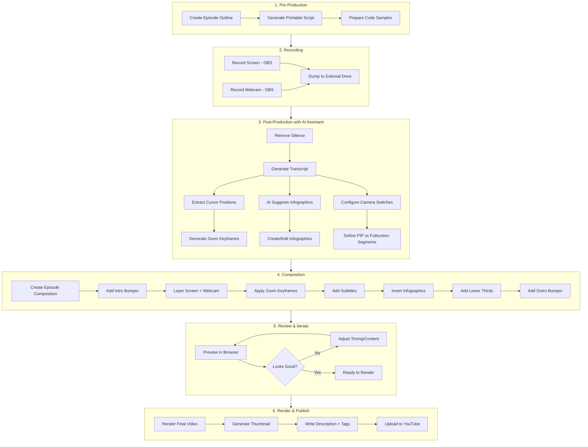

# Remotion Video Projects

Video animations and tutorial compositions for ArtiVisi YouTube channel.

## Complete Production Workflow



## AI-Assisted Workflow Summary

| Step | What You Do | What AI Does |
|------|-------------|--------------|
| Outline | Provide topic & key points | Generate structured outline with timestamps |
| Recording | Record screen + webcam | - |
| Silence Removal | Run script | Detect & remove silent sections |
| Transcription | Run Whisper | Generate timestamped transcript |
| Zoom/Pan | Run cursor extraction | Auto-generate zoom keyframes from cursor movement |
| Infographics | Review suggestions | Suggest slides/callouts based on transcript keywords |
| Camera Switching | Define preferences | Generate switch points based on content type |
| Subtitles | Review output | Generate from transcript |
| Render | Run command | - |
| Upload | Provide credentials | Generate title, description, tags from transcript |

---

## Project Structure

```
src/
├── animations/           # Standalone bumper animations
│   ├── vlog-intro/      # "NGOPI DULU" intro bumper
│   ├── lower-third/     # Name/title overlay
│   ├── transition/      # "artivisi" letter animation
│   └── outro/           # End screen
├── components/          # Reusable tutorial components
│   ├── VideoLowerThird.tsx
│   ├── WebcamOverlay.tsx
│   ├── ZoomPan.tsx
│   ├── CodeHighlight.tsx
│   ├── Subtitles.tsx
│   └── Infographic.tsx
├── tutorials/           # Tutorial video series
│   ├── programming-fundamentals/
│   ├── building-app-with-ai/
│   └── networking-cloud/
└── assets/
    ├── audio/
    ├── icons/
    └── logos/
```

## Quick Start

```bash
npm install
npm start        # Preview in browser
npm run build    # Bundle for rendering
```

## Render Bumpers

```bash
npx remotion render VlogIntro out/vlog-intro.mp4
npx remotion render LowerThird out/lower-third.mp4
npx remotion render Transition out/transition.mp4
npx remotion render Outro out/outro.mp4
```

---

## Step-by-Step Production Guide

### 1. Storage Setup (One-time)

Keep project on laptop, store large files on external drive:

```bash
# Create folders on external drive
mkdir -p /Volumes/YOUR_EXTERNAL_DRIVE/remotion-footage/{programming-fundamentals,building-app-with-ai,networking-cloud}
mkdir -p /Volumes/YOUR_EXTERNAL_DRIVE/remotion-output

# Create symlinks
rm -rf footage out
ln -s /Volumes/YOUR_EXTERNAL_DRIVE/remotion-footage footage
ln -s /Volumes/YOUR_EXTERNAL_DRIVE/remotion-output out
```

### 2. Pre-Production: Create Outline

```bash
# Copy template
cp src/tutorials/programming-fundamentals/_template.ts \
   src/tutorials/programming-fundamentals/pf-01.ts

# Generate printable outline for recording
node scripts/generate-outline.mjs src/tutorials/programming-fundamentals/pf-01.ts
```

### 3. Recording

Record with OBS (or similar):
- **Screen recording**: `footage/programming-fundamentals/pf-01-screen.mp4`
- **Webcam recording**: `footage/programming-fundamentals/pf-01-webcam.mp4`

Tips:
- Record screen and webcam separately for flexibility
- Use consistent naming: `{series}-{episode}-{type}.mp4`

### 4. Post-Production with AI Assistant

Once footage is dumped to external drive, start a session with Claude:

```
"I have recorded footage for Programming Fundamentals Episode 1.
Files are in footage/programming-fundamentals/pf-01-screen.mp4 and pf-01-webcam.mp4.
Let's process and create the video."
```

The AI assistant will guide you through:

#### 4.1 Remove Silence

```bash
# Quick: remove silence and output new file
./scripts/remove-silence.sh footage/programming-fundamentals/pf-01-screen.mp4

# Or for more control: detect first, review, then apply
./scripts/detect-silence.sh footage/programming-fundamentals/pf-01-screen.mp4
# Review the -silence.txt file, then:
node scripts/detect-silence.mjs footage/programming-fundamentals/pf-01-screen-silence.txt \
  --output src/tutorials/programming-fundamentals/pf-01-edl.ts
```

#### 4.2 Generate Transcript

```bash
# Transcribe with Whisper (Indonesian)
./scripts/transcribe-with-whisper.sh footage/programming-fundamentals/pf-01-screen.mp4 \
  --model medium --language id

# Convert to Remotion format
node scripts/process-transcript.mjs \
  footage/programming-fundamentals/pf-01-screen.json \
  src/tutorials/programming-fundamentals/pf-01-transcript.ts
```

#### 4.3 Auto-Generate Zoom Keyframes

```bash
# Extract cursor positions
python scripts/extract-cursor.py footage/programming-fundamentals/pf-01-screen.mp4

# Generate zoom keyframes
node scripts/generate-zoom-keyframes.mjs \
  footage/programming-fundamentals/pf-01-screen.cursor.json \
  --output src/tutorials/programming-fundamentals/pf-01-zoom.ts
```

#### 4.4 Generate Infographics (AI-Assisted)

Ask the AI assistant:
```
"Based on the transcript, suggest infographics (slides, bullet points, callouts)
that would enhance the video. Focus on key concepts and important tips."
```

The AI will analyze the transcript and generate infographic cues.

#### 4.5 Configure Camera Switching (AI-Assisted)

Ask the AI assistant:
```
"Based on the transcript and outline, determine when to show:
- Webcam fullscreen (introductions, explanations, conclusions)
- Screen with webcam PIP (coding, demos)
- Screen only (complex code, diagrams)"
```

The AI will generate camera switch cues based on content analysis.

### 5. Create Composition

The AI assistant will help create/update the composition file:

```tsx
// src/tutorials/programming-fundamentals/PF01Composition.tsx
import { AbsoluteFill, OffthreadVideo, Sequence } from "remotion";
import { VlogIntro } from "../../animations/vlog-intro/VlogIntro";
import { Outro } from "../../animations/outro/Outro";
import { ZoomPan, WebcamOverlay, Subtitles, Infographic, VideoLowerThird } from "../../components";
import { pf01Transcript, pf01Subtitles } from "./pf-01-transcript";
import { pf01ZoomKeyframes } from "./pf-01-zoom";
import { pf01CameraSwitches, pf01Infographics } from "./pf-01-cues";

export const PF01: React.FC = () => {
  return (
    <AbsoluteFill>
      {/* Intro */}
      <Sequence durationInFrames={150}>
        <VlogIntro />
      </Sequence>

      {/* Main content */}
      <Sequence from={150} durationInFrames={...}>
        {/* Screen recording with zoom */}
        <ZoomPan keyframes={pf01ZoomKeyframes}>
          <OffthreadVideo src={staticFile("footage/.../pf-01-screen.mp4")} />
        </ZoomPan>

        {/* Webcam overlay - switches between PIP and hidden */}
        <WebcamOverlay
          src={staticFile("footage/.../pf-01-webcam.mp4")}
          position="bottom-right"
          size="medium"
        />

        {/* Subtitles */}
        <Subtitles cues={pf01Subtitles} />

        {/* Infographics at specific timestamps */}
        {pf01Infographics.map((info, i) => (
          <Sequence key={i} from={info.showAtFrame} durationInFrames={info.duration}>
            <Infographic content={info.content} />
          </Sequence>
        ))}

        {/* Lower thirds for references */}
        <Sequence from={300} durationInFrames={150}>
          <VideoLowerThird title="Source Code" link="github.com/artivisi/..." />
        </Sequence>
      </Sequence>

      {/* Outro */}
      <Sequence from={...}>
        <Outro />
      </Sequence>
    </AbsoluteFill>
  );
};
```

### 6. Preview & Iterate

```bash
npm start
# Open browser, select composition, review
```

Work with AI to adjust:
- Timing of infographics
- Zoom keyframe positions
- Camera switch points
- Subtitle styling

### 7. Render

```bash
npx remotion render PF01 out/pf-01-final.mp4
```

### 8. Upload to YouTube

Ask the AI assistant:
```
"Generate YouTube metadata (title, description, tags) based on the episode outline and transcript."
```

Then upload via YouTube Studio or CLI:
```bash
# Using youtube-upload (pip install youtube-upload)
youtube-upload --title="..." --description="..." out/pf-01-final.mp4
```

---

## Components Reference

### VideoLowerThird

Animated title/link overlay.

```tsx
<VideoLowerThird
  title="Introduction to Variables"
  subtitle="Programming Fundamentals"
  link="github.com/artivisi/examples"
  position="bottom-left"
  showAt={90}
  hideAt={270}
  accentColor="#22c55e"
/>
```

### WebcamOverlay

Picture-in-picture webcam.

```tsx
<WebcamOverlay
  src={webcamVideoSrc}
  position="bottom-right"
  size="medium"           // small | medium | large
  shape="rounded"         // circle | rounded | rectangle
  borderColor="#22c55e"
  showAt={0}
  hideAt={9000}
/>
```

### ZoomPan

Keyframe-based zoom and pan for screencast focus.

```tsx
<ZoomPan
  keyframes={[
    { frame: 0, x: 0.5, y: 0.5, scale: 1 },
    { frame: 300, x: 0.3, y: 0.2, scale: 2 },
    { frame: 600, x: 0.5, y: 0.5, scale: 1 },
  ]}
  easing="smooth"
>
  <OffthreadVideo src={screencastSrc} />
</ZoomPan>
```

### CodeHighlight

Syntax-highlighted code overlay.

```tsx
<CodeHighlight
  code={`function hello() {\n  console.log("Hello!");\n}`}
  title="example.js"
  highlightLines={[2]}
  size="large"
  showAt={0}
  hideAt={300}
/>
```

### Subtitles

Display subtitles from transcript.

```tsx
<Subtitles
  cues={subtitleCues}
  position="bottom"
  style="default"         // default | boxed | outline
  fontSize={48}
/>
```

### Infographic

Display slides, bullet lists, callouts, or images.

```tsx
<Infographic
  content={{
    type: "bullet-list",
    title: "Key Concepts",
    items: ["Variables", "Data Types", "Functions"],
    highlightIndex: 1,
  }}
  position="center"
  showAt={300}
  hideAt={600}
/>
```

---

## Scripts Reference

| Script | Purpose |
|--------|---------|
| `generate-outline.mjs` | Generate printable recording outline |
| `remove-silence.sh` | One-step silence removal |
| `detect-silence.sh` | Detect silence regions |
| `detect-silence.mjs` | Convert silence data to EDL |
| `transcribe-with-whisper.sh` | Run Whisper transcription |
| `process-transcript.mjs` | Convert transcript to Remotion format |
| `extract-cursor.py` | Extract cursor positions from video |
| `generate-zoom-keyframes.mjs` | Generate zoom keyframes from cursor data |

---

## Prerequisites

```bash
# Node.js dependencies
npm install

# Python dependencies (for transcription & cursor tracking)
pip install openai-whisper opencv-python numpy

# FFmpeg (for silence detection)
brew install ffmpeg  # macOS
```
